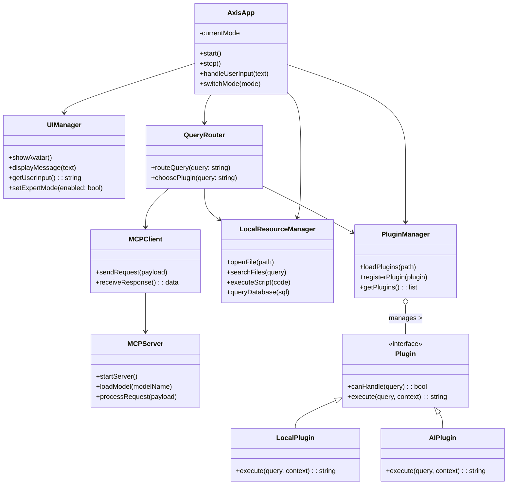
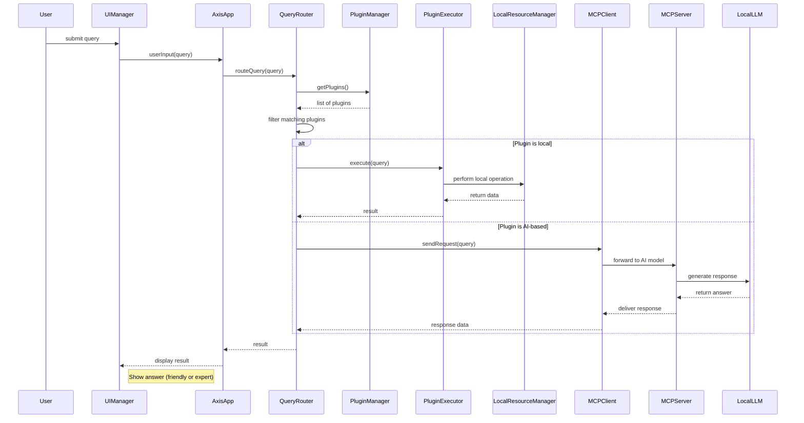
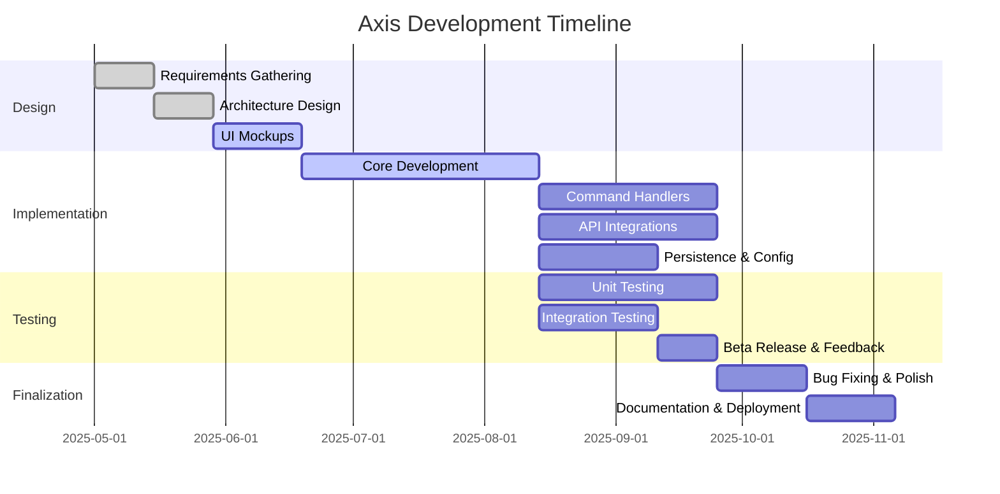

# Axis Developer Reference

## Introduction & Overview

Axis is a cross-platform, locally-hosted AI desktop assistant with a modular, extensible architecture. It is designed for privacy, performance, and developer flexibility, supporting both friendly and expert user modes. The standard stack is Electron (frontend) and Python + FastAPI (backend). Axis is intended to help users perform tasks via a graphical interface and natural language commands, with a focus on extensibility, reliability, and a rich user experience.

## Requirements

### Functional Requirements

- **Interactive Assistive UI:** Friendly avatar/interface, text (and optionally voice) input/output, suggestions, and help prompts.
- **Expert Mode:** Toggleable mode for verbose logs, raw outputs, and advanced configuration.
- **Command Processing:** Accept and parse user input, execute actions (local or AI-powered), answer questions, automate tasks.
- **Task Automation:** Launch apps, open files/URLs, schedule reminders, manage to-dos.
- **Integration with Services:** Connect to web APIs (weather, calendar, etc.), handle secure configuration.
- **Plugin/Extension System:** Runtime loading of plugins/skills, supporting both local and AI-powered operations.
- **Context Awareness:** Maintain session context for follow-up queries and continuity.
- **Customization:** User preferences, custom commands, macros, and workflow configuration.

### Non-Functional Requirements

- **Local-Only Operation:** All components run locally for privacy and offline use.
- **Cross-Platform:** Windows, macOS, Linux (Electron for UI, FastAPI for backend logic).
- **Performance:** Fast startup, low latency, responsive UI, efficient resource use.
- **Security:** Permission checks for sensitive actions, local data encryption, sandboxed code execution.
- **Extensibility:** Modular, loosely-coupled components and plugins.
- **Reliability:** Graceful error handling, robust logging, and easy updates.

## System Architecture

Axis is structured as a desktop application with the following key modules:

- **AxisApp (Core):** Orchestrates startup, state, and lifecycle.
- **UIManager:** Electron-based UI, avatar, dialogs, expert/friendly modes.
- **QueryRouter:** Routes queries to plugins or backend (FastAPI/MCP).
- **PluginManager:** Loads and manages plugins/skills.
- **LocalResourceManager:** File, DB, script APIs (Python backend).
- **MCPClient/MCPServer:** Local AI model and tool interface (Python backend, FastAPI endpoints).

### Class Diagram

### Sequence Diagram Example

## Core Functionality

- **Local Capabilities:** File ops, DB, code/shell exec, app control (via Python backend).
- **MCP Integration:** Local AI model, context, tool access (via FastAPI endpoints).
- **Query Routing:** UI → AxisApp → QueryRouter → PluginManager → Plugin (local/AI) → result → UI.
- **Plugin System:** Plugins implement `canHandle` and `execute`, can be local or AI-enabled. Plugins are loaded at runtime and can declare metadata for routing.

## Plugin / Skills System

- Plugins are Python modules (backend) or JavaScript modules (frontend, if needed for UI extensions).
- Each plugin must implement:
  - `canHandle(query: string) -> bool`
  - `execute(query: string, context: dict) -> string`
- Plugins can be local-only or AI-enabled (using MCPClient for LLM access).
- Example: CalendarPlugin (local DB), SummaryPlugin (AI/LLM).
- Plugins use provided managers for resource access and must not block the main thread.

## User Interface (Electron)

- **Friendly Assist Mode:** Default, avatar/mascot, simple language, proactive suggestions, animations.
- **Expert Mode:** Toggleable, verbose logs, raw outputs, config panels, direct console, advanced settings.
- **Configurable:** Settings panel for preferences, plugins, LLM, etc.
- **Interaction Flow:**
  1. User enters query (text/voice)
  2. UI passes input to backend
  3. Backend processes and returns response
  4. UI displays response (with extra details in Expert Mode)

## Data Storage & Configuration

- Local SQLite DB for user data, history, plugin state, cache (Python backend).
- Configurable via UI or config files.
- Security: Explicit permission for sensitive actions, all data local.

## Implementation Guidelines

1. Set up core modules per architecture (Electron UI, FastAPI backend).
2. Implement safe local APIs (file, DB, code) in Python backend.
3. Integrate local MCP server and client (FastAPI endpoints for LLM/tools).
4. Define plugin interface and loader (Python backend).
5. Build UI (avatar, chat, expert toggle) in Electron.
6. Create demo plugins (local and AI).
7. Add expert features (logging, config, verbose output).

## Testing & QA

- **Unit Testing:** Each module/class has unit tests (pytest/unittest for Python, Jest for JS if needed).
- **Integration Testing:** Test interactions between backend modules and UI.
- **System Testing:** Validate end-to-end functionality on all platforms.
- **UI Testing:** Automate UI workflows (e.g., Playwright for Electron).
- **Continuous Testing:** Integrate tests into CI pipeline (GitHub Actions, etc.).
- **Test Design:** Use equivalence partitioning and boundary value analysis. Follow the testing pyramid (unit > integration > e2e). Track coverage, prioritize meaningful tests.

## Project Management

- Lightweight Agile (sprints or Kanban), daily/bi-daily standups, feature branches, code reviews.
- Version control, CI/CD, demos, incremental docs.
- Milestones: Alpha (core), Beta (features), Release Candidate, Stable.
- Semantic versioning (MAJOR.MINOR.PATCH), changelog, tagged releases.
- Release process: Every release has notes, version numbers updated automatically.

### Example Gantt (see roadmap for details)

## Roadmap

Axis development proceeds through milestones aligned with feature sets. The roadmap below outlines the major phases and planned releases:

### Milestones and Schedule

- **Alpha (v0.x):** Develop core functionality (app skeleton, command parsing, basic desktop control). Internal testing only.
- **Beta (v1.0.x-beta):** Implement remaining major features (weather, calendar integration, advanced UI). Start external testing or limited user feedback. Polish UI/UX.
- **Release Candidate:** Fix bugs from beta, finalize documentation, prepare for production.
- **Stable (v1.0.0):** Official release with all planned features. Continue maintenance (v1.0.1, etc. for bug fixes), then plan next major version.
- **v1.1.0:** New minor features (e.g. reminders, extended API integrations).
- **v2.0.0:** Future version with any breaking changes or large enhancements.

### Gantt Chart

In this chart, each task has a start date and duration. Overlapping is allowed (e.g. unit testing begins while implementation proceeds). Checkpoints include Alpha feature-complete, Beta release, and Stable release. Milestones might be: requirements sign-off, UI prototype ready, core implementation done, Beta available for testing.

## Versioning & References

- Semantic versioning (MAJOR.MINOR.PATCH), pre-releases for alpha/beta.
- Changelog follows [Keep a Changelog](https://keepachangelog.com/).
- References: Agile Manifesto, SemVer, Software Testing, Wikipedia links (see detailed.md).
- For user docs, see [../axis.md](../axis.md)
