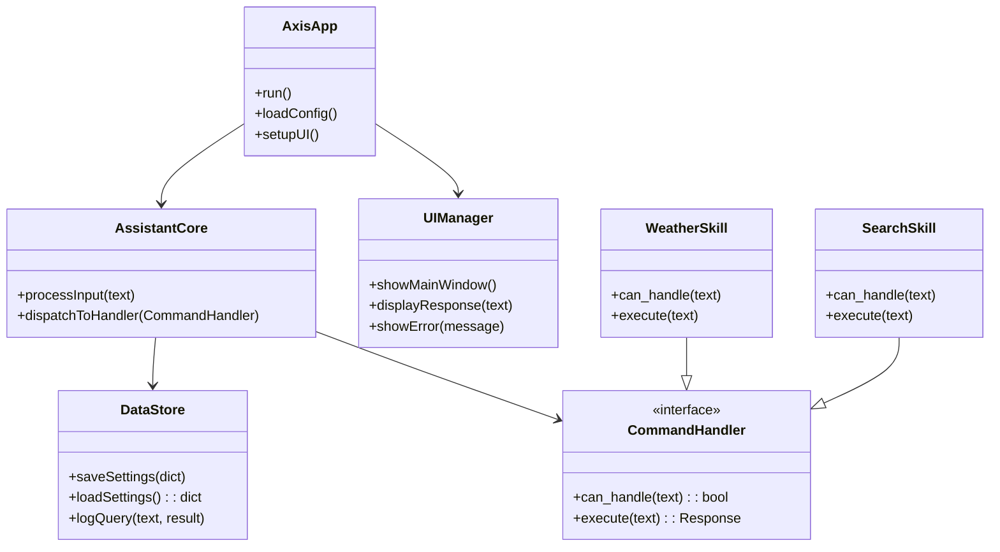
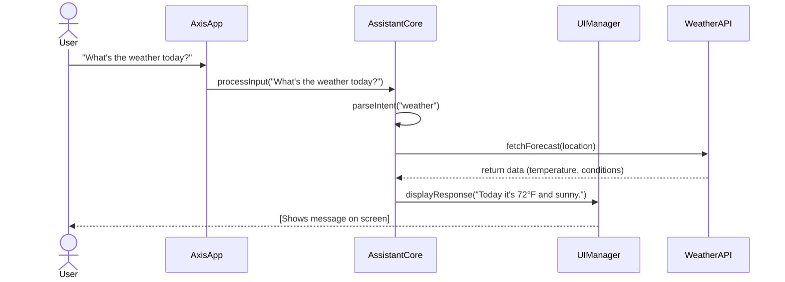
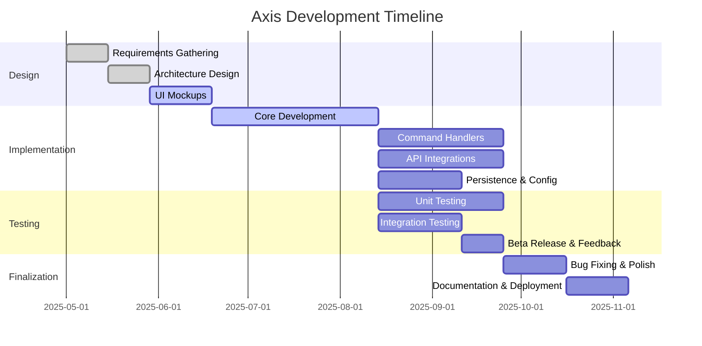

# Axis Desktop Assistant – Detailed Documentation

## Introduction

Axis is a cross-platform desktop assistant application built with Python and PySide6 (Qt6) designed to help users perform tasks via a graphical interface and natural language commands. It will run on Windows, macOS, and Linux, providing features like answering user queries, launching applications, managing files, and integrating with online services (weather, calendar, etc.). Axis aims to be lightweight yet extensible, with a modular architecture so new skills (actions) can be added easily.  

This documentation describes the comprehensive technical specifications, functional requirements, system architecture, testing strategy, development methodology, project timeline, and versioning plan for Axis. It is intended to guide a small development team through design, implementation, and release, following industry best practices for software engineering and project management.

## Functional Overview

Axis will provide the following core functional features:

- **Command Processing:** Accept user input via text or (optionally) speech, parse natural language commands or queries, and execute appropriate actions. For example, answering questions (using local knowledge or online APIs), performing calculations, or controlling the desktop environment.
- **Task Automation:** Launch applications, open files or URLs, schedule reminders, and perform routine tasks (e.g. setting system volume, managing to-do lists).
- **Integration with Services:** Connect to web APIs for weather forecasts, news, or calendar events. Handle configuration for user accounts or tokens securely.
- **User Interface:** A main window with a console or chat-like view for interaction, plus optional panels (e.g. a settings dialog, a history of commands). The UI should be responsive and accessible, following Qt best practices.
- **Customization:** Allow users to configure behavior (e.g. choose a default search engine or assistants’ name) and define custom commands (user-provided scripts or macros).
- **Cross-platform Consistency:** Same feature set and look-and-feel on all supported platforms. Use Qt’s styles and system integration (notifications, tray icon) to blend in natively.

**Non-functional requirements** include: high reliability (as a desktop service), low memory footprint, fast startup, and intuitive UX. Axis should gracefully handle failures (e.g. network timeouts), log errors, and support easy updates.

## Technical Specifications

- **Language & Framework:** Python 3.10+ (latest stable), with PySide6 (Qt for Python) for the GUI. This leverages Qt6’s cross-platform capabilities and Qt Designer for UI prototypes. Using PySide6 ensures access to Qt6 features (widgets, threading, etc.) without C++.
- **Architecture Pattern:** Model–View–Controller (MVC) or Model–View–ViewModel (MVVM) is recommended. The *Model* manages data (user settings, history, etc.), the *View* is the Qt GUI, and the *Controller* (or ViewModel) handles user input and coordinates actions.
- **Dependencies:** Aside from PySide6, use standard libraries and minimal external packages. Possible libraries include: `requests` (HTTP API calls), `speech_recognition`/`pyttsx3` (for optional voice I/O), `sqlite3` or `TinyDB` for local data storage, and test libraries like `pytest`. Avoid heavy GUI frameworks to keep binary size small.
- **Data Storage:** A lightweight embedded database (e.g. SQLite) or JSON files for user preferences, command history, and cache. Ensure encryption or obfuscation if sensitive data (like API keys) is stored.
- **Threading and Concurrency:** Use Qt’s thread or asynchronous patterns to avoid blocking the UI when performing long tasks (network calls, file I/O). For example, QThread or `asyncio` with Qt’s event loop can keep the interface responsive.
- **Logging:** Implement a logging subsystem (using Python’s `logging` module) to record errors, warnings, and info messages. Logs should be optionally saved to file (rotating daily) for debugging by developers.
- **Security:** Since Axis may execute user commands, enforce constraints (e.g. disallow dangerous system operations). Validate and sanitize any input that is used in shell commands or web requests. If user scripts are allowed, run them in a restricted environment.
- **Build & Deployment:** Package Axis as an installable application on each platform (PyInstaller or the Qt Installer Framework). Use semantic versioning tags for releases. Provide an auto-update mechanism or at least clear upgrade instructions.
- **Internationalization (optional):** Plan for localization by marking all user-facing strings for translation.

## System Architecture

Axis’s architecture is modular. A high-level view consists of:

- **AxisApp (Main Application):** Initializes the GUI, loads configuration, and starts the main event loop.
- **UI Manager:** Manages windows and widgets (main window, dialogs, status updates). It receives output from the core and updates the interface.
- **Assistant Core:** The brains of Axis – it processes user input, dispatches commands to handlers, communicates with external services, and returns responses.
- **Command Handlers (Skills):** Separate modules or classes for each domain (e.g. `WeatherSkill`, `SystemControlSkill`, `SearchSkill`). They expose a uniform interface (e.g. `can_handle(query)` and `execute(query)`).
- **Data Store / Persistence:** Manages reading/writing user data (history, settings). Could be abstracted behind a Data Access Object (DAO) class.
- **External APIs / Services:** Interfaces to web APIs or OS services. Axis core will use adapter classes to fetch data (e.g. a `WeatherAPI` class).
- **Logging Service:** A component that collects log messages from all parts of the app and writes to file or console.

In this class diagram, **AxisApp** orchestrates startup and combines components. The **UIManager** handles all GUI operations, interacting with Qt widgets. **AssistantCore** takes user input and finds an appropriate **CommandHandler** (like `WeatherSkill` or `SearchSkill`) to execute the command. The **DataStore** persists user settings and history. This design promotes separation of concerns and testability (handlers can be tested independently).

### Sequence Diagram Example

The following Mermaid sequence diagram illustrates a sample interaction: the user asks for the weather, the application processes the request, calls an external API, and updates the UI.

In this flow, the **AxisApp** receives the user’s query and forwards it to **AssistantCore**. The core parses the intent, recognizes a weather request, and delegates to a `WeatherAPI`. Once data is retrieved, the core instructs **UIManager** to present the response to the user.

## Technical Details

- **UI Layout:** Use Qt Designer or code for UI layout. A main window with a text entry (or voice button) and an output area (could be a `QTextEdit` or list view). Additional menu or settings dialog for preferences. Use Qt’s signals/slots for inter-component communication.
- **Threading Model:** Heavy tasks (API calls, voice recognition) should run in background threads. Example: a `QThread` or `QtConcurrent` for asynchronous operations. Ensure thread-safe updates (e.g. use `QObject::signal` to send results back to the main thread for UI updates).
- **Configuration:** Store user settings (like default location for weather, voice on/off) in a JSON or INI file under the user’s home directory. Load these at startup; allow changes in a settings dialog.
- **Error Handling:** All external calls (network, file) must handle exceptions. Show user-friendly error messages (via UIManager) if something fails (e.g. “Could not fetch weather – check your internet connection.”). Log technical details for developers.
- **Extensibility:** Define a plugin interface for adding new command handlers. For example, a base `CommandHandler` class can be subclassed; the AssistantCore can dynamically load all handlers from a `plugins/` folder at startup.
- **Packaging:** Decide on an installer/packaging solution early. For example, use PyInstaller to create a single executable, or use cross-platform packaging tools. Ensure inclusion of the Qt libraries and any required resources (icons, data files).
- **Documentation:** Document public APIs and modules. Include a README and inline docstrings. Use Sphinx or Qt’s QDoc if needed for developer reference.

## Testing Strategy

A thorough testing strategy is crucial. We apply multiple test types:

- **Unit Testing:** Each module/class has unit tests (using pytest or unittest). For example, test that `SearchSkill` returns expected results given a fixed query. Mock external APIs to test logic without internet.
- **Integration Testing:** Test interactions between components. For instance, simulate the AssistantCore with a mock command handler and ensure the UIManager receives the correct output.
- **System Testing:** Validate end-to-end functionality on each platform (Windows, macOS, Linux). Ensure the app starts, the main features work, and the GUI renders correctly.
- **UI Testing:** Automate UI workflows (using tools like PySide6’s QTest framework or a GUI testing tool). Test that button clicks and text inputs produce the expected changes.
- **Continuous Testing:** Integrate tests into a CI pipeline, running on every commit (using GitHub Actions, GitLab CI, etc.), including cross-platform checks.

Two fundamental test-design techniques are **Equivalence Partitioning** and **Boundary Value Analysis**. In equivalence partitioning, input data is divided into classes that are treated similarly. For example, if a feature accepts an integer from 1–100, one partition is [1–100], another is below 1, and another is above 100. Only a representative value from each partition needs testing. Boundary value analysis then tests at the edges of these partitions ([Boundary-value analysis - Wikipedia](https://en.wikipedia.org/wiki/Boundary-value_analysis#:~:text=Boundary,be%20ordered%2C%20and%20that%20the)) – e.g. 0, 1, 100, 101 – since defects often occur at limits. Using these techniques ensures we cover key cases without redundant tests.

Finally, follow the **testing pyramid**: write many fast unit tests, fewer integration tests, and still fewer end-to-end tests ([Software testing - Wikipedia](https://en.wikipedia.org/wiki/Software_testing#:~:text=Software%20testing%20should%20follow%20a,8)). For example, for every feature add a set of unit tests; for critical user flows, include higher-level tests. Track test coverage (aim for >80%), but prioritize meaningful tests over sheer quantity.

## Project Management Methodology

Given the small team (2–4 developers), we recommend a lightweight Agile approach:

- **Agile Values:** Emphasize **Individuals and interactions** and **Working software** as stated in the Agile Manifesto ([Agile software development - Wikipedia](https://en.wikipedia.org/wiki/Agile_software_development#:~:text=,change%20over%20following%20a%20plan)). Hold brief daily stand-ups or sync meetings to communicate progress, not long reports.
- **Iteration & Backlog:** Use 2-week iterations (sprints) with a prioritized backlog. In sprint planning, identify features or fixes to address. For a very small team, roles are flexible: team members share responsibilities (e.g. one handles coding, another writes tests, but both review each other’s code).
- **Kanban Option:** Alternatively, a Kanban board can track tasks with columns (To Do, In Progress, Done). This minimizes overhead of fixed sprints but maintains continuous flow.
- **Version Control:** All code in a Git repository. Use feature branches and pull requests, even informally, to review code. Merge only tested code into the main branch.
- **CI/CD:** Set up continuous integration to automatically run tests on each push. Consider continuous delivery for nightly builds or alpha releases.
- **Documentation & Demos:** At the end of each sprint, produce a short demo of new functionality. Update user/developer documentation incrementally rather than all at the end.

> *Best Practice:* Keep meetings short and decisions lightweight. The team should be self-organizing and empowered to make technical decisions. Adapt processes if they become too cumbersome.

### Milestones and Schedule

Axis development will proceed through milestones aligned with feature sets. A basic schedule might be:

- **Alpha (v0.x):** Develop core functionality (app skeleton, command parsing, a few commands like search and basic desktop control). Internal testing only.
- **Beta (v1.0.x-beta):** Implement remaining major features (weather, calendar integration, advanced UI). Start external testing or limited user feedback. Polish UI/UX.
- **Release Candidate:** Fix bugs from beta, finalize documentation, prepare for production.
- **Stable (v1.0.0):** Official release with all planned features. Continue maintenance (v1.0.1, etc. for bug fixes), then plan next major version.

Below is a sample Gantt chart (Mermaid) for planning key activities over 6 months. Adjust dates as needed:

In this chart, each task has a *start date* and *duration*. Overlapping is allowed (e.g. unit testing begins while implementation proceeds). Checkpoints include *Alpha feature-complete*, *Beta release*, and *Stable release*. Milestones (marked on the chart) might be: requirements sign-off, UI prototype ready, core implementation done, Beta available for testing.

## Versioning Plan

Axis will follow **Semantic Versioning (SemVer)** ([Semantic Versioning 2.0.0 | Semantic Versioning](https://semver.org/#:~:text=2,1.11.0)). The version number is MAJOR.MINOR.PATCH.  

- **0.y.z (Alpha):** During initial development, Axis will use 0.y.z versions. As per semver, “Major version zero (0.y.z) is for initial development. Anything MAY change at any time. The public API SHOULD NOT be considered stable.” ([Semantic Versioning 2.0.0 | Semantic Versioning](https://semver.org/#:~:text=4,SHOULD%20NOT%20be%20considered%20stable)). Each alpha release (e.g. 0.1.0, 0.2.0) corresponds to feature sets. Breaking changes are expected in this phase.
- **1.0.0 (Beta):** Once the core features are implemented and the API (if any) is defined, Axis 1.0.0 will be the first beta/stable milestone. According to SemVer, “Version 1.0.0 defines the public API.” ([Semantic Versioning 2.0.0 | Semantic Versioning](https://semver.org/#:~:text=4,SHOULD%20NOT%20be%20considered%20stable)) After 1.0.0, increments follow standard rules:
  - **Patch (x.y.Z):** Backward-compatible bug fixes.
  - **Minor (x.Y.z):** New backward-compatible functionality.
  - **Major (X.y.z):** Incompatible changes.
- **Pre-release labels:** For pre-release milestones, use semantic labels (e.g. 1.0.0-alpha, 1.0.0-beta). This clarifies stability. For example, 0.5.0-alpha could be an early alpha build, while 1.0.0-beta indicates release candidate quality.

A possible feature grouping by version:

- **v0.1.x (Alpha):** Basic command parsing, simple math and search commands, minimal UI.
- **v0.2.x (Alpha):** Add weather and time commands, settings persistence, logging.
- **v0.3.x (Alpha):** Enhance UI (theme, notifications), more system control (open app, system info).
- **v1.0.0 (Beta):** All major features complete (calendar integration, voice I/O, plugin system). Beta testing with selected users.
- **v1.0.x (Stable):** Bug fixes and minor improvements post-beta.
- **v1.1.0:** New minor features (e.g. reminders, extended API integrations).
- **v2.0.0:** Future version with any breaking changes or large enhancements (e.g. migrating to a different GUI framework or backend API).

By following semantic versioning, we ensure users and developers have clear expectations about stability and compatibility when updating Axis.

## Testing Standards

Axis’s quality assurance will include:

- **Equivalence Partitioning:** Divide input domains into classes. For example, if a command field accepts numeric input 1–100, create tests for typical valid range (e.g. 50), below range (e.g. 0), and above range (e.g. 101). This reduces test cases while ensuring coverage of error conditions.
- **Boundary Value Analysis:** Test boundary values of input ranges. Using the same example (1–100), test 1 and 100 (edges), plus one step beyond (0 and 101) ([Boundary-value analysis - Wikipedia](https://en.wikipedia.org/wiki/Boundary-value_analysis#:~:text=Boundary,be%20ordered%2C%20and%20that%20the)). Edge cases often expose bugs in handling limits.
- **Behavioral Tests:** Beyond input validation, test the behavior of interactive features (e.g. that the UI updates correctly, or that asking “What is 2+2?” returns “4”).
- **Regression Testing:** Automated tests run on each code change ensure new code does not break existing functionality. Use a test suite invoked by the CI system after each commit.
- **Acceptance Criteria:** For each user story or feature, define clear acceptance tests. For instance, “When the user clicks the ‘Search’ button with text X, the default web browser opens at the search results page for X.” These can be manual checklists or automated GUI tests.

## Project Management Summary

Axis development will follow a pragmatic agile approach with minimal overhead, suitable for a small cross-functional team:

- **Team Roles:** Even in a very small team, assign a lead (who could also act as product owner) to make final feature decisions. Share coding and testing tasks among team members. Rotate roles as needed for knowledge sharing.
- **Communication:** Use a lightweight ticketing or kanban board to track tasks. Hold a quick meeting (5–15 minutes) daily or every other day to sync up. Use version control and code reviews to maintain code quality.
- **Documentation:** Continuously update this documentation. Maintain a changelog that follows [Keep a Changelog](https://keepachangelog.com/) guidelines so users see what changed each version.
- **Release Process:** Every release (even alpha) should have release notes. Tag releases in Git and update version numbers in code automatically (e.g. via a version.py or by reading from a config).
  
By combining Agile practices (continuous integration, iterative sprints, and collaboration) with pragmatic lean management, the team can remain flexible and efficient without heavy bureaucracy ([Agile software development - Wikipedia](https://en.wikipedia.org/wiki/Agile_software_development#:~:text=,change%20over%20following%20a%20plan)) ([Software testing - Wikipedia](https://en.wikipedia.org/wiki/Software_testing#:~:text=Software%20testing%20should%20follow%20a,8)).

---

**References:** Concepts of equivalence partitioning and boundary-value analysis ([Boundary-value analysis - Wikipedia](https://en.wikipedia.org/wiki/Boundary-value_analysis#:~:text=Boundary,be%20ordered%2C%20and%20that%20the)) were applied in testing strategy. The Agile methodology values come from the Agile Manifesto ([Agile software development - Wikipedia](https://en.wikipedia.org/wiki/Agile_software_development#:~:text=,change%20over%20following%20a%20plan)). Semantic Versioning rules are from the official SemVer spec ([Semantic Versioning 2.0.0 | Semantic Versioning](https://semver.org/#:~:text=4,SHOULD%20NOT%20be%20considered%20stable)) ([Semantic Versioning 2.0.0 | Semantic Versioning](https://semver.org/#:~:text=4,SHOULD%20NOT%20be%20considered%20stable)). Software testing principles (pyramid, unit vs integration) are based on standard practice ([Software testing - Wikipedia](https://en.wikipedia.org/wiki/Software_testing#:~:text=Software%20testing%20should%20follow%20a,8)).
