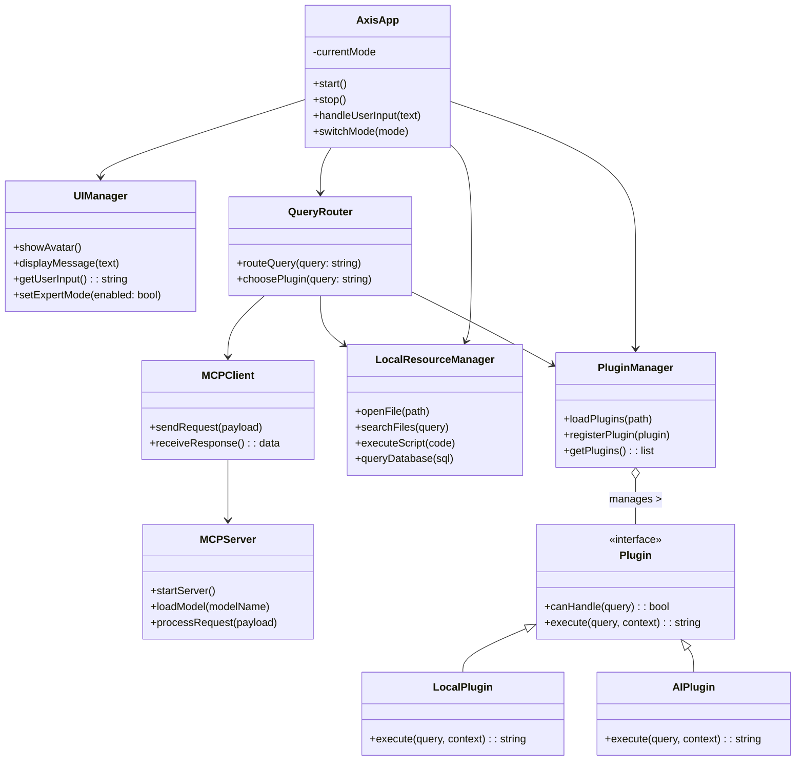
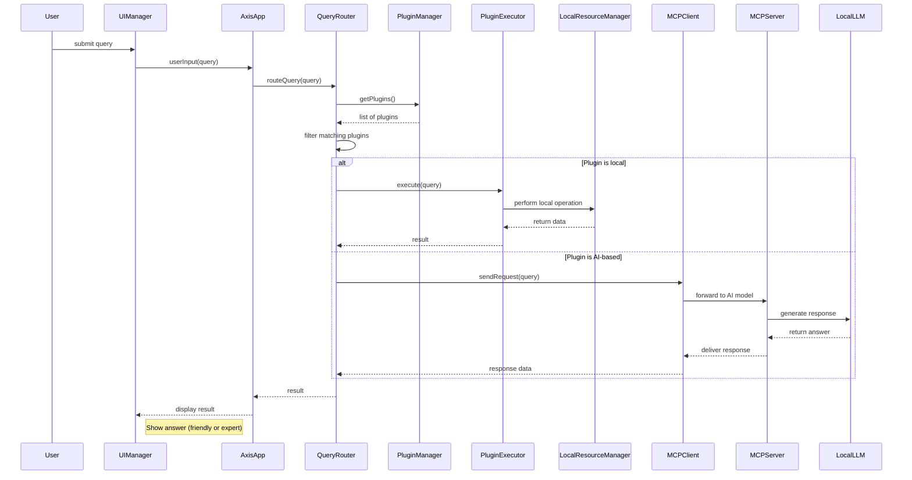
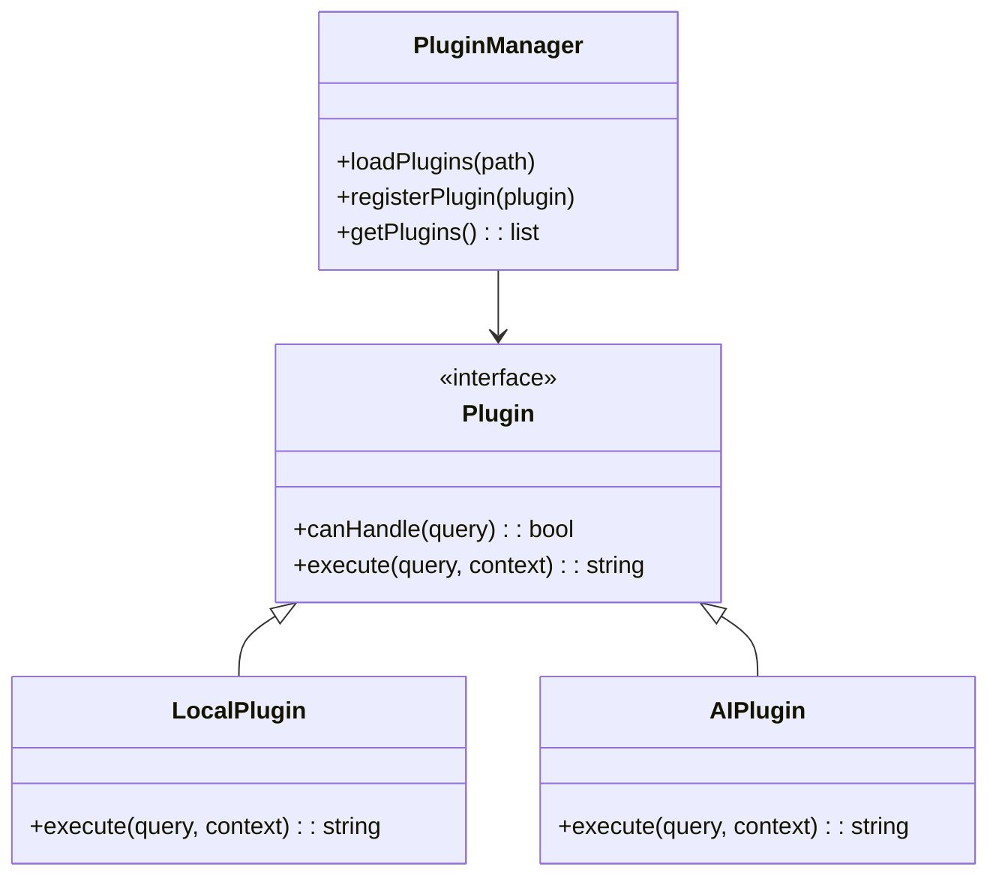

# Axis Desktop Assistant – Technical Specification

## Overview

Axis is a locally-hosted AI-powered desktop assistant that combines a friendly, interactive user interface with advanced, extensible capabilities. The assistant offers a personality-driven experience (similar to classic virtual assistants like BonziBuddy or Clippy) while also providing an **Expert Mode** for technical users who require more detailed feedback and configuration options. Axis is designed to operate entirely on the user’s machine (no external cloud servers). It features core conversational abilities and plugin-based extensions, enabling powerful automated assistance across different tasks.

The system architecture is modular and extensible: core logic routes user queries to either local capabilities (file operations, database queries, script execution, etc.) or to AI-powered plugins via a local MCP server. The user interface remains friendly and approachable in normal mode, yet allows toggling into a verbose expert-level mode with additional details. The following sections outline the functional requirements and technical specifications needed for implementation.

## Requirements

### Functional Requirements

- **Interactive Assistive UI:** The assistant shall present a friendly avatar or interface (with animations or visual cues) to engage users and provide suggestions or help prompts. It should handle text (and optionally voice) input and output conversationally.
- **Expert Mode:** Provide a switchable expert mode that exposes advanced information, logs, and detailed outputs. Expert Mode allows power users to see low-level data (such as raw LLM responses, execution traces, or detailed logs) and to adjust configurations at runtime.
- **Local Capabilities:** Axis must include built-in local skills, such as file system browsing, opening applications, and executing user-provided scripts. These functions run directly on the machine without requiring AI.
- **AI-Powered Skills:** Axis should leverage local AI models via an MCP (Model Context Protocol) server for generative tasks like summarization, question answering, or natural language reasoning.
- **Plugin/Extension System:** Developers should be able to extend Axis by adding new plugins or skills. The system should support loading plugins at runtime, and each plugin can choose to use either local methods or the MCP server for its operation.
- **Context Awareness:** The assistant should maintain conversation context within a session, enabling follow-up queries and references to previous interactions.

### Non-Functional Requirements

- **Local-Only Operation:** All components of Axis must run locally on the user’s machine. There should be no reliance on external servers or cloud services at runtime. This ensures user privacy and offline availability.
- **Cross-Platform Compatibility:** The application should support major desktop operating systems (Windows, macOS, Linux). Use cross-platform frameworks or clearly specify any OS-specific dependencies.
- **Performance:** The system should respond promptly to user inputs. Local queries should return results with minimal latency. AI-powered queries should utilize GPU (if available) or a reasonably efficient LLM to minimize delay.
- **Security:** Running user-provided code or accessing files carries risk. The system should implement permission checks (with user approval) for sensitive actions. Data stored locally (DB, logs) should be secured or user-accessible as needed.
- **Extensibility:** The architecture should favor modularity. Plugins and core components should be loosely coupled and follow clear interfaces, enabling easy addition of new features or replacement of components.

## System Architecture

Axis is structured as a desktop application composed of the following key modules:

- **AxisApp (Core):** The main orchestrator. It initializes other components, handles application lifecycle (startup, shutdown), and maintains global state (current mode, user session data).
- **UIManager:** Manages the user interface. It displays the assistant avatar and dialogs, captures user input (text/voice), and renders responses. It also provides UI elements to switch between normal and expert modes.
- **QueryRouter:** Responsible for receiving a user query (text or intent) and deciding how to handle it. It consults the PluginManager to find suitable plugins and routes the request accordingly (either locally or via MCP).
- **PluginManager:** Dynamically loads and manages skill plugins. On startup (and optionally at runtime), it scans a plugins directory for new modules, instantiates them, and maintains a registry of available skills.
- **LocalResourceManager:** Provides APIs for local operations such as file system access, database queries, and code/script execution. Plugins use this manager to perform direct system actions in a controlled way.
- **MCPClient / MCPServer:** The MCPClient is a module within Axis that communicates with the local MCPServer over HTTP or another IPC mechanism. The MCPServer is a separate local service (potentially a subprocess) that hosts AI models and provides contextual tools. Plugins or the core can send requests to the MCPClient, which forwards them to the MCPServer. The server processes the request (possibly invoking a local LLM) and returns a result.

These components interact as follows: The UIManager captures user input and forwards it to the AxisApp. AxisApp logs the input and calls the QueryRouter. The QueryRouter asks PluginManager for plugins that can handle the query. If a plugin is available, the QueryRouter checks the plugin’s metadata to decide whether to execute it locally or send the request to MCP. After obtaining a response (either from the local plugin or from the MCP via AI), AxisApp may do final formatting and instruct UIManager to display the result.

## Core Functionality

### Local Capabilities

Axis provides several built-in local features that are available without invoking the AI model. These include:

- **File System Operations:** Navigate folders, search for files by name or content, and open files with the associated application. For example, the assistant can open a requested document or search the user’s directory tree if asked (“Find my presentation slides”). The `LocalResourceManager` implements these operations securely.
- **Local Database Storage:** Store and retrieve persistent information in a local database (e.g., SQLite). This database can hold user settings, conversation history, notes, or cache data. Plugins can query or update the database via the `LocalResourceManager`.
- **Code/Shell Execution:** Execute user-provided code or scripts in a sandboxed manner, if allowed. For example, a user could ask Axis to run a small Python script or shell command. This uses the `LocalResourceManager`’s code execution API, which must enforce safety (e.g., by confirmation prompts or sandboxes).
- **Application Control:** Launch or manipulate local applications and system settings (with permission). For instance, opening a calendar app or adjusting volume. These actions are invoked through the OS interface from Axis.

### MCP Integration and Local AI Models

For language-based or generative queries, Axis utilizes a local AI model accessed via the Model Context Protocol (MCP). An **MCP Server** runs on the local machine (it can be a subprocess launched by AxisApp). The MCP Server provides endpoints for the AI model and tools (such as file reading or database queries) that the model can use in generating responses.

Axis communicates with the MCP Server using an **MCPClient** component. When the QueryRouter determines that a query should be handled by AI, it packages the query and relevant context into a request and sends it through MCPClient to the MCP Server. The AI model on the server processes the input (optionally using data from local tools) and returns a response. The core application then takes that response (possibly invoking post-processing in a plugin) and displays it to the user.

This setup allows Axis to leverage powerful language models locally, without exposing data externally. Developers can configure which local model to use (e.g., GPT-J, LLaMA, or others) by configuring the MCP Server. The MCP Server can also provide additional tools to the model via its protocol (for example, a file tool that lets the LLM access specific project files on demand).

### Query Routing Logic

When the user enters a query or command, the following sequence occurs:

1. **Capture Input:** `UIManager` captures the text (or voice-transcribed text) and passes it to `AxisApp`.
2. **Logging:** `AxisApp` logs the query in the local database for history/context.
3. **Plugin Matching:** `QueryRouter` asks `PluginManager` for a list of plugins whose `canHandle(query)` method returns true. Plugins may advertise keywords or intents they handle.
4. **Select Execution Path:** The router examines each matching plugin:
   - **Local Skill:** If a plugin is marked as local, the router invokes it directly. The plugin uses `LocalResourceManager` or internal logic to generate a result.
   - **AI Skill:** If a plugin requires AI, the router prepares an MCP request. It invokes the `MCPClient`, which forwards the query to the local MCPServer. The server’s AI model processes it and returns an answer.
5. **Fallback to LLM:** If no plugin claims the query, the system defaults to an AI-based approach. The QueryRouter can send the query to the MCP server as a generic assistant skill. The AI then tries to respond using any available context.
6. **Result Handling:** After obtaining a result, `AxisApp` may format it (or invoke plugin post-processing) and returns it to the UI. If in Expert Mode, additional debug information (such as which plugin was used, raw LLM output, etc.) is also available.
7. **Present to User:** `UIManager` displays the response. In Friendly Mode it is presented simply; in Expert Mode additional details and logs are shown alongside the answer.

Below is a sequence diagram illustrating a typical user query flow:

## Plugin / Skills System

Axis’s extensibility comes from its plugin-based (skills) architecture. Developers can add new skills by creating plugins that adhere to a simple interface. Each plugin is typically a separate file or module, placed in a designated plugins directory. At startup, `PluginManager` scans this directory, loads plugins, and registers them.

Each plugin must implement at least two functions or methods:
- `canHandle(query: string) -> bool`: Returns true if the plugin can process the given query. This could be based on keyword matching, intent detection, or explicit trigger phrases.
- `execute(query: string, context: dict) -> string`: Performs the plugin’s action and returns a response string. The `context` includes objects like the `LocalResourceManager` and an `MCPClient` for optional AI access. Plugins should not block the main thread; long-running tasks can be asynchronous.

Plugins declare in their metadata whether they are **local-only** or **AI-enabled**. A local plugin will run entirely via code (using `LocalResourceManager` if needed). An AI plugin will likely use `MCPClient` to call the LLM (for example, sending the query to the LLM and formatting the answer). The QueryRouter uses this metadata to route queries appropriately.

The plugin system allows versatile skill development. For example:
- *Local Skill Example:* A `CalendarPlugin` that reads/writes events from a local SQLite calendar database. It uses `LocalResourceManager` to query or update the DB and returns schedule information.
- *AI Skill Example:* A `SummaryPlugin` that takes a long text snippet and returns a summary. It sends the text to the MCPServer (using `MCPClient`) and outputs the model’s summary.

When a plugin needs to access resources, it should use the provided managers. For instance, within a plugin’s `execute` method, the plugin can call `context['resourceManager']` for file or DB operations and `context['mcpClient']` to invoke the AI model. This keeps resource access consistent and controlled by the core application.

## User Interface

Axis’s user interface has two primary modes:

- **Friendly Assist Mode:** The default mode where the assistant acts as a helpful companion. The UI displays an avatar or mascot that can animate (e.g., react to voice input or show expressions). The assistant shows messages in simple language. It can offer proactive suggestions (e.g., “You have a meeting at 3 PM, would you like a reminder?”) and guide users. The focus is on simplicity and clarity.
- **Expert Mode:** A toggleable mode for power users. In Expert Mode, the UI shows more verbose information: detailed logs of processing steps, raw plugin output or LLM responses, and configuration panels. Advanced settings (like choosing the LLM model, adjusting memory usage, or tweaking plugin behavior) are accessible. Expert Mode may also allow entering commands directly in a console view.

In both modes, the UI should remain non-intrusive. The assistant can reside in a window, sidebar, or system tray icon that expands to show dialogs. Visual notifications (bubbles or pop-ups) can appear if the assistant has something to say without user prompt (for example, task reminders). Animations and friendly graphics are encouraged in Friendly mode, while Expert Mode prioritizes clarity of technical information.

### Interaction Flow

1. The user enters a query via a text box (or speaks a command). The UI passes this input to AxisApp.
2. Axis processes the query (see Query Routing logic) and returns a response.
3. The UI displays the response text via a speech bubble or chat window. The avatar may have a talking or thinking animation.
4. In Expert Mode, beneath or next to the response, the UI also shows additional details (like which plugin was used, timestamps, or resource usage stats).

Throughout, the UI should offer configuration options: a settings panel accessible from the interface allows users to change preferences (e.g., enable/disable voice, manage plugins, switch LLM models, or clear the chat history).

## Data Storage and Configuration

Axis uses a local database (e.g., SQLite) to persist data across sessions. The database schema might include tables for:

- **User Data:** Preferences (voice on/off, expert mode default, etc.), profile information.
- **Conversation History:** Log of user queries and assistant responses, for context or analytics. Depending on privacy settings, this history can be cleared by the user.
- **Plugin Data:** Any persistent state needed by plugins (e.g., a to-do list, user-defined tasks).
- **Cache/Indexes:** Data used to speed up operations (file index for search, cache of previous LLM answers).

Configuration options (accessible via the UI) allow setting file paths, selecting the local LLM model, adjusting resource limits, and enabling/disabling plugins. These settings can be stored in the database or in a configuration file.

**Security:** Sensitive actions (like writing to disk or executing code) should require explicit user permission. The UI should allow users to grant or revoke these permissions. All data remains on the user’s machine.

## Implementation Guidelines

To implement this specification, developers should:

1. **Core Modules:** Set up the project structure with the core modules (`AxisApp`, `UIManager`, `QueryRouter`, etc.) according to the architecture diagram.
2. **LocalResourceManager:** Implement local operations with safe APIs (file I/O, DB access, code execution with sandboxing).
3. **MCP Integration:** Integrate a local MCP server instance. For example, use an existing open-source MCP server framework. Implement `MCPClient` in the app to send/receive JSON requests to the server process.
4. **Plugin Interface:** Define the plugin interface (e.g., abstract base class or protocol) and build `PluginManager` to discover and load plugins dynamically (by scanning a directory or using entry points).
5. **User Interface:** Develop the UI framework, including the avatar and chat/dialog system. Implement the mode toggle. Ensure the UI can render rich text and handle animations for the avatar.
6. **Demonstration Plugins:** Create example plugins to validate the system (one local-skill plugin, one AI-powered plugin). Test the query routing logic and adjust as needed.
7. **Expert Mode Features:** Add logging, configuration dialogs, and verbose output for Expert Mode.

With this design, Axis can be developed iteratively: starting with basic UI and local commands, then adding the plugin loader, and finally integrating the local AI model. The architecture ensures the assistant has a useful core of local functionality while allowing easy expansion through both local code and AI-powered features. Each component has a clear interface, so a small dev team can implement and test modules in parallel. 

