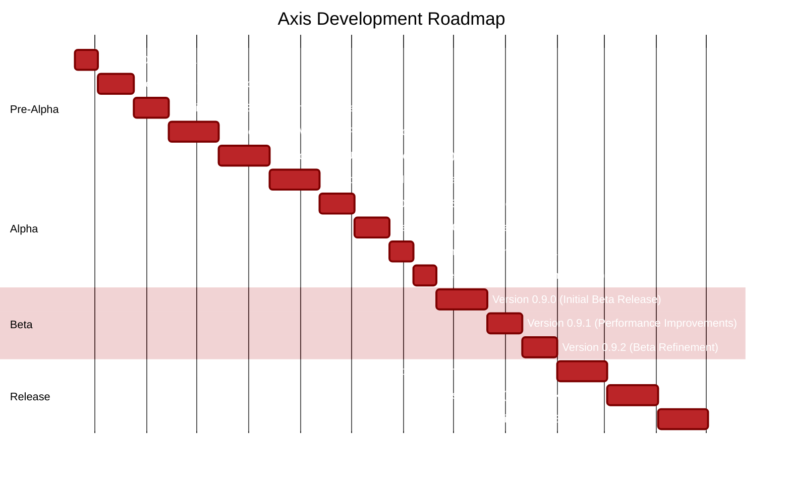

# Axis Development Roadmap

This page outlines the development roadmap for Axis, including upcoming releases, planned features, and long-term vision.

## Current Development Status

Axis is currently in pre-release development. The team is actively working toward the first official release.

## Roadmap Visualization

## Release Plans

### Version 1.0.0: Initial Public Release

The first official release of Axis will provide a Windows desktop assistant powered by MCP Server capabilities.

#### Planned Key Features

- Natural language interface for computer control
- Deep Windows OS integration
- MCP Server implementation for AI capabilities
- Context-aware assistance
- Application control via voice or text
- File management through natural language
- System monitoring and optimization

#### System Requirements

- Windows 10 (version 1903 or newer) or Windows 11
- 4GB RAM (8GB recommended)
- 500MB available disk space
- 2GHz dual-core processor
- Internet connection for full functionality

### Version 1.1.0

After the initial release, we plan to enhance Axis with additional capabilities:

- Enhanced programming assistance tools
- Integration with popular cloud storage services
- Custom automation workflows
- Improved offline capabilities
- Performance optimizations for laptops and low-powered devices

### Version 1.2.0

Further enhancements will include:

- Advanced data analysis capabilities
- Deep integration with Microsoft 365
- Media management tools
- Expanded developer APIs
- Additional language support

## Pre-Release Development Milestones

### Version 0.9.2 - Beta

- **Focus Areas:**
  - Enhanced startup performance improvements
  - Memory usage optimization
  - Natural language processing accuracy refinement
  - Better handling of context switching between applications
  - Bug fixes for known crash issues

### Version 0.9.1 - Beta

- **Focus Areas:**
  - System performance monitoring implementation
  - Battery optimization settings
  - Custom voice commands support
  - MCP Server connection stability
  - Response time improvements
  - Windows notifications integration

### Version 0.9.0 - Beta

- **Focus Areas:**
  - Initial implementation of the MCP Server client
  - Core Windows integration capabilities
  - Basic voice command recognition
  - Fundamental application control
  - File search and management
  - Address high CPU usage during initial scanning

### Version 0.8.5 - Alpha

- **Focus Areas:**
  - First implementation of the user interface
  - Basic command processing
  - Windows shell integration
  - System tray functionality
  - Core stability improvements

## Long-Term Vision (Beyond Version 1.2)

Our long-term roadmap for Axis includes:

### Multi-Platform Support

- Expanding to macOS and Linux platforms
- Ensuring consistent experience across operating systems

### Advanced AI Integration

- Deeper AI capabilities with specialized domain knowledge
- Improved personalization based on usage patterns
- Enhanced context understanding capabilities

### Enterprise Features

- Advanced team collaboration features
- Centralized deployment and management
- Company-specific knowledge integration
- Enhanced security and compliance features

### Ecosystem Expansion

- Rich marketplace for third-party extensions
- Integration with more third-party services and applications
- Open APIs for broader developer engagement

## How We Prioritize Features

When planning new versions, we prioritize:

1. **User Value**: Features that deliver the most value to users
2. **Technical Foundation**: Building robust technical infrastructure
3. **User Feedback**: Addressing the most requested features from beta testers
4. **Technology Advancements**: Leveraging new AI and system capabilities as they emerge

## Providing Feedback

Your feedback is essential for shaping Axis's future. Please share your suggestions through:

- In-app feedback tool (in pre-release versions)
- Email: <axis-feedback@auxiliary.com>
- Beta tester forum: [beta.auxiliary.com/axis](https://beta.auxiliary.com/axis)

We particularly value feedback on:

- Feature requests
- Performance issues
- User experience pain points
- Integration needs

## Version Numbering

Axis follows semantic versioning (MAJOR.MINOR.PATCH):

- **MAJOR**: Significant new features or fundamental changes
- **MINOR**: New features and improvements with backward compatibility
- **PATCH**: Bug fixes and minor improvements

---

*Note: This roadmap represents our current plans and is subject to change based on user feedback, technical considerations, and strategic priorities.*
